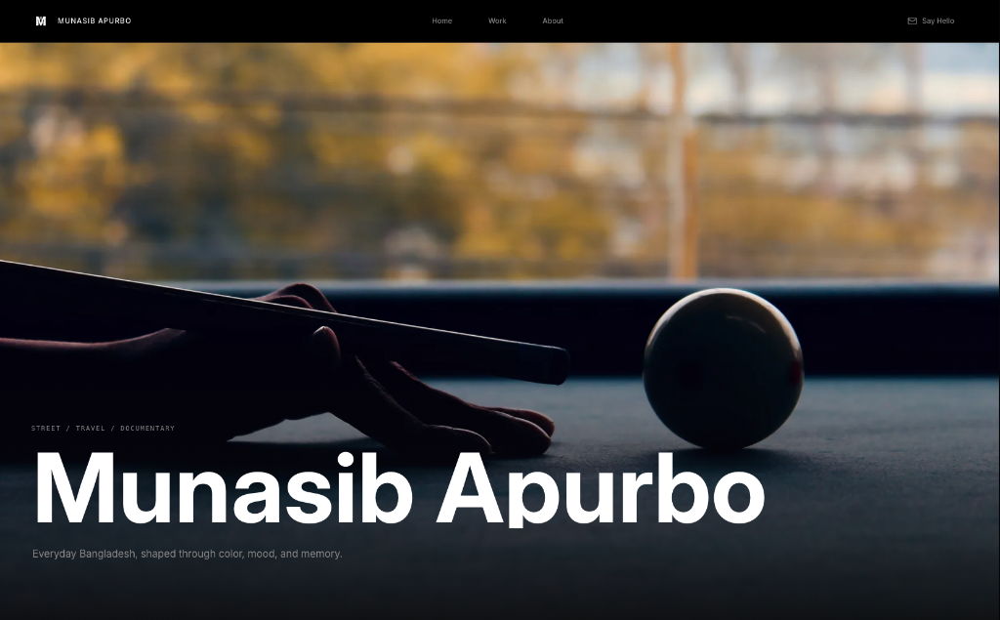

# Minimalist Photography Portfolio Template

A premium, highly polished photography portfolio built with React, TypeScript, and Framer Motion. 

This repository was designed for photographers who want a minimalist, lightning-fast showcase for their work that doesn't get in the way of the photos. It includes ultra-smooth inertia scrolling (via Lenis), custom masonry layouts, Touch-gestures for mobile lightboxes, and a custom build pipeline that optimizes and categorizes your images automatically.



> [!NOTE]
> This repository is preloaded with DSLR-viewfinder vector skeletons to serve as a **fully functioning demo** of the dynamic masonry grid, category filtering, and chromatic sorting features. This allows the template to compile and run instantly without requiring heavy, copyrighted photography files.

---

## Key Design Principles

1. **Focus on the Media**: Dark mode by default, clean margins, and an elegant, typographic scale (using Outfit and Inter) so that your work is the primary focus.
2. **Inertia & Smooth Motion**: Smooth physics-based scrolling and subtle fluid transitions create an organic, premium desktop experience.
3. **Automated Image Optimizations**: A pre-configured Sharp pipeline processes original photographs down to lightweight web-ready sizes, extracts dominant color families, and clusters them dynamically.

---

## Quick Start

### 1. Install Dependencies
```bash
npm install
```

### 2. Configure Your Profile
Everything is controlled from a single configuration file. Open `src/config.ts` and update it with your biography, stats, and links:

```typescript
export const config = {
  name: 'Munasib Apurbo',
  title: 'Munasib Apurbo | Photography',
  email: 'hello@example.com',
  socials: {
    linkedin: 'https://linkedin.com/...',
    github: 'https://github.com/...',
  },
  baseUrl: 'https://munasibapurbo.com/',
  
  hero: {
    title: 'Munasib Apurbo',
    subtitle: 'Everyday moments, shaped through color, mood, and memory.',
    heroImageName: 'street_placeholder.svg',
  },
  
  about: {
    heading: 'I look for quiet moments that stay with me.',
    paragraphs: [
      "Hey, I shoot street, travel, and documentary stories...",
      "I try to find the beauty in mundane streets..."
    ],
    stats: {
      focus: 'Street, travel, documentary',
      location: 'Dhaka, Bangladesh',
      gear: 'Sony A7IV • 35mm • 85mm',
    }
  }
};
```

---

## Managing Your Gallery

No manual cropping, aspect ratio math, or color grouping needed. The template includes a custom-built processing script:

1. Place your raw camera exports (supports `.jpg`, `.png`, `.heic`, `.webp`) inside the `raw-images/` folder.
2. Run the processing script:
   ```bash
   npm run optimize
   ```

### Behind the Scenes
* **Multi-size Output**: Generates optimized dual WebP variants (`-900.webp` and `-1800.webp`) inside `public/optimized/` using Sharp.
* **Aspect Ratio Extraction**: Calculates exact ratios to lay out the masonry grid seamlessly without jumps or cumulative layout shifts.
* **Color Family Classification**: Scales photos to `1x1` to read dominant RGB channels, maps them to HSV color bands (Red, Orange, Yellow, Green, Cyan, Blue, Violet, Neutral), and writes metadata directly to `src/data/photoManifest.ts`.
* **Category Assigning**: Open [src/data/photoManifest.ts](src/data/photoManifest.ts) to easily change titles and assign categories (like `'Street'` or `'Nature'`). The script retains your titles and categories across future runs!

---

## Commands

* **Local Dev Server**: Launch development build with hot module reloading:
  ```bash
  npm run dev
  ```
* **Production Build**: Compile and optimize down to fully-static production assets:
  ```bash
  npm run build
  ```
* **Preview Build**: Preview the compiled production build locally:
  ```bash
  npm run preview
  ```

---

## Deployment

Since this builds to standard static HTML, JS, and CSS, it can be hosted for free on any modern static platform:

### Netlify (Recommended)
This repo contains a pre-configured `netlify.toml` file setting up aggressive cache-headers for static `.webp` assets and clean fallback routing. Just connect your GitHub repo, set the build command to `npm run build`, and publish directory to `dist`.

### Vercel
Connect your repo to Vercel, select **Vite** as the framework preset, and click deploy.
